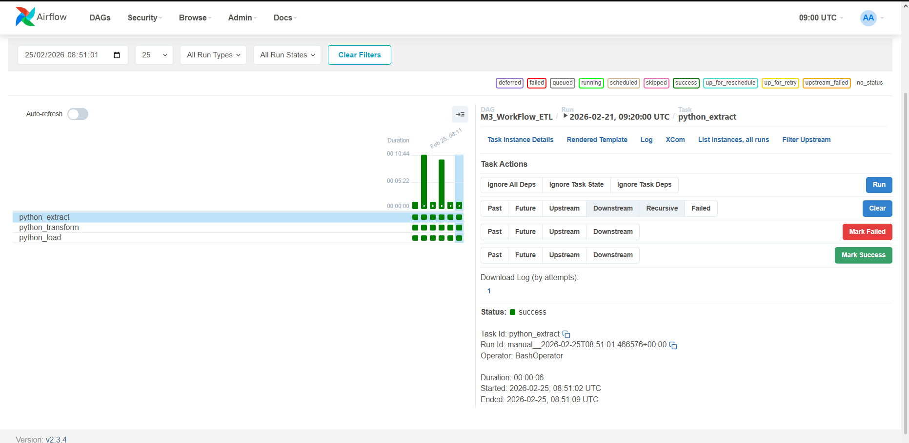
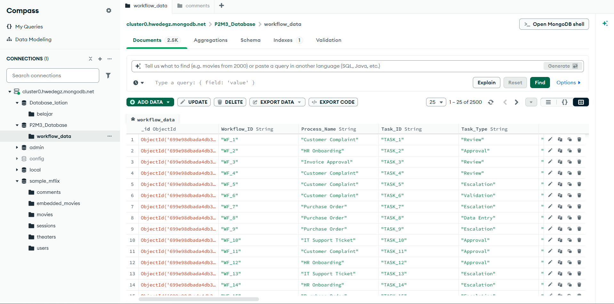

# Automated ETL Pipeline with Airflow, PySpark, and MongoDB

## Project Overview
This project builds an automated **ETL (Extract, Transform, Load) data pipeline** using Apache Airflow, PySpark, and MongoDB. The pipeline processes workflow operational data and automates the process of extracting raw data, transforming it, and loading the processed results into a NoSQL database.

The goal of this project is to simulate a real-world **data engineering pipeline** where data processing tasks are orchestrated automatically and executed on a scheduled basis.

---

## Objectives
The objectives of this project are:

- Build an automated data pipeline using **Apache Airflow**
- Process and transform data using **PySpark**
- Perform **data validation using Great Expectations**
- Store processed data into **MongoDB Atlas**
- Implement scheduled data workflow automation

---

## Dataset
The dataset used in this project contains workflow optimization data that represents different operational processes within an organization.

Examples of important attributes include:

- Workflow_ID
- Process_Name
- Task_ID
- Task_Type
- Priority_Level
- Approval_Level
- Estimated_Time_Minutes
- Actual_Time_Minutes
- Delay_Flag
- Employee_Workload

The dataset represents operational workflows such as:

- Customer complaints
- HR onboarding
- Purchase order processes
- IT support ticket handling

---

## Data Validation
Before implementing the pipeline, the dataset was validated using **Great Expectations** to ensure data quality.

Several validation rules were applied, including:

- Unique column validation
- Value range validation
- Allowed category validation
- Data type validation
- Logical relationship validation between columns

These validations ensure that the dataset is reliable before entering the automated pipeline.

---

## ETL Pipeline Architecture

The data pipeline follows the ETL architecture:

Extract → Transform → Load

The entire workflow is orchestrated using **Apache Airflow DAG**.

---

## Extract Stage
The **Extract** stage reads the raw dataset using **PySpark** and loads it into a Spark DataFrame.

Example implementation:

```python
spark = SparkSession.builder.getOrCreate()

df = spark.read.csv(
    file_path,
    header=True,
    inferSchema=True
)
```

This step prepares the dataset for further processing.

---

## Transform Stage
The **Transform** stage performs data processing and transformation using **PySpark**.

A new column named **Delay_Status** is created based on the value of `Delay_Flag`.

Transformation logic:

- Delay_Flag = 1 → Delay
- Delay_Flag = 0 → No Delay

The transformed dataset is then saved for the loading process.

---

## Load Stage
The **Load** stage stores the processed dataset into **MongoDB Atlas**.

The loading process includes:

1. Converting Spark DataFrame to Python dictionary format
2. Connecting to MongoDB Atlas
3. Removing previous records
4. Inserting the transformed dataset

Database information:

Database: `P2M3_Database`  
Collection: `workflow_data`

---

## Workflow Orchestration
The entire ETL pipeline is automated using **Apache Airflow**.

The DAG consists of three tasks:

1. **Extract** → execute `extract.py`
2. **Transform** → execute `transform.py`
3. **Load** → execute `load.py`

Task dependency structure:

Extract → Transform → Load

---

## Pipeline Schedule
The pipeline is scheduled with the following configuration:

Start Date: **1 November 2024**

Execution schedule:

- Every Saturday
- 09:10 AM
- 09:20 AM
- 09:30 AM

The pipeline runs automatically at these intervals.

---

## Tools and Technologies
This project utilizes the following technologies:

- Apache Airflow
- PySpark
- MongoDB Atlas
- Great Expectations
- Python
- Docker

---

## Project Structure

```
project-directory
│
├── extract.py
├── transform.py
├── load.py
├── P2M3_Christian_Ambarita_DAG.py
├── P2M3_Christian_Ambarita_GX.ipynb
├── P2M3_Christian_Ambarita_data_raw.csv
├── P2M3_Christian_Ambarita_DAG_graph.jpg
├── P2M3_Christian_Ambarita_screenshot_mongo.jpg
└── README.md
```

---

## DAG Workflow



---

## MongoDB Result



---

## Conclusion
This project demonstrates how modern data engineering tools can be integrated to create an automated ETL pipeline. By combining **Airflow for orchestration**, **PySpark for data processing**, and **MongoDB for data storage**, the system is capable of handling automated data workflows efficiently and reliably.

This type of architecture is commonly used in real-world data platforms to ensure scalable and automated data processing.

---

## Author
Christian Ambarita  
Hacktiv8 – Comprehensive Data Analytics Program
